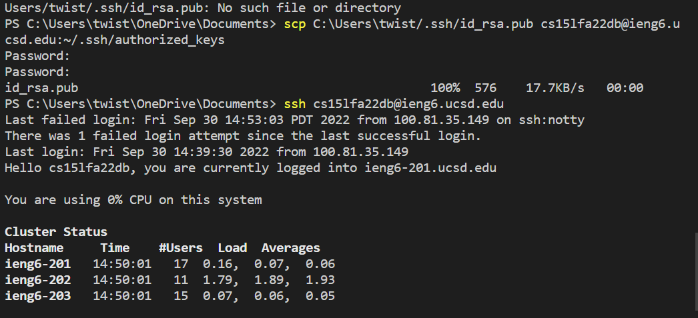

<<<<<<< HEAD
# Lab Report 1 #
## Setting up Visual Code ##

* [VSCode](https://code.visualstudio.com/download)

* Follow the link and follow the download button specific to your OS.
* Set up VSCode specific to the programming langauge you want, in this case it's Java.
* In this case, VSCode was already downloaded so I cannot provide further steps.

## Remotely Connection ##
* First you want to open the terminal within VSCode and type in ssh cs15lfa22xx@ieng6.ucsd.edu.
* Remember to replace xx with the two letters that correspond to your personal user account that can be found on UCSD account lookup.
* If you follow the steps correctly, the terminal should look like this.
    

## Run Some Commands ##
* Next it's important to test out some commands within your terminal now that you're logged into the ssh.
* Some things that are nice to test out are what would be ls, cd, and a more advanced command.

* In this screenshot, the command "ls" shows the current files or content in your directory. "cd" navigates through directories and "cat" opens files.

## Moving Files over SSH with scp ##
* First we want to move files from the local computer to a remote server with the command "scp".
* We want to first create a class called WhereAmI where it would summarize our identity.

* As you can see we compile the file with "javac", and then run the file with "java"
* Now we want to move this file from our local system to our remote server.
* We want to use the command (scp WhereAmI.java cs15lfa22zz@ieng6.ucsd.edu:~/)

* As you can see the file is moved and when "ls" is inputted it's in our remote server's directory.

## SSH Keys ##
* We want to create a private and public key that will allow us to login into our remote server seamlessly without having to type in our password everytime.
* We will use the command $ ssh-keygen on our local computer first, which will create the key.

* Next we will transfer our local key saved and save it onto our remove server.
* You want to use scp and the location of your key and for my case would be C:\Users\twist/.ssh/id_rsa.pub

* We now log into the remote server and now no password is needed.

## Making Remote Running Even More Pleasant ##
* We want to shortcut some tasks by running our previous commands with the same time as opening the remote server.
* Using the original command **ssh cs15lfa22xx@ieng6.ucsd.edu** followed with a basic command like "ls" we can get the list of the directory and login to the remote server at the same time.

* As you can see we now have logged into the server and executed ls at the same time.

**That wraps up our tutorial for getting familiar with ssh and seeing what you can do within the terminal.**
=======
#Lab Report#
>>>>>>> 034e626c1209d748d8b5f79708035d39a6936d6a
