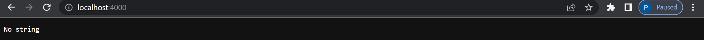
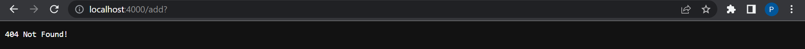

# Lab Report 2 #
## **Creating a Search Engine on a Local/Remote Web Server** ##

* This lab will contain the explanation of integrating a search engine into a local/remote webserver and also the debugging of bugs and how to identify them.

* First, we're going to start with the implementation of a search engine and how it was done with a concise walkthrough of the code.
~~~ 
{
    class Handler implements URLHandler {
        ArrayList<String> word = new ArrayList<String>();
        String searched = new String();
        String substrng = "";
        public String handleRequest(URI url) {
            if (url.getPath().equals("/")) {
                return String.format("No string");
            } else if (url.getPath().equals("/search")) {
                String[] parameters1 = url.getQuery().split("=");
                    if (parameters1[0].equals("s")) {
                        substrng = parameters1[1];
                    for (int i = 0; i< word.size(); i++){
                            if (word.get(i).contains(substrng)){
                                searched += (word.get(i) + " ");
                        }
                    }
                    return String.format(searched);
                }
                return "404 Not Found";
            } else {
                System.out.println("Path: " + url.getPath());
                if (url.getPath().contains("/add")) {
                    String[] parameters = url.getQuery().split("=");
                    if (parameters[0].equals("s")) {
                        word.add(parameters[1]);
                        return String.format("String added");
                    }
                }
                return "404 Not Found!";
            }
    }
}         
~~~

**Add String** 

* Adding a String to the list is fundamental in being able to search/test the code so with the picture down below, it is shown that adding through the url is successful.

* To break down what is exactly happening we can break down the code by parts.

~~~
{
    System.out.println("Path: " + url.getPath());
        if (url.getPath().contains("/add")) {
}
~~~

* The url.getPath() method is called from the URLClasshandler which will obtain the path from the link and check for /add which prompts that adding a string is about to happen.

~~~
{
    String[] parameters = url.getQuery().split("=");
        if (parameters[0].equals("s")) {
            word.add(parameters[1]);
            return String.format("String added");
        }
    }
    return "404 Not Found!";
}
~~~

* What's happening next is that getQuery() is gonna obtain the next piece of the url such as when ? is apart of the code. 

* By using getQuery().split("="), the left side of = and right side will be split into an array where it can be accessed through indexing of an array. To prompt the adding of a string, it checks for an "s" on the left side of = and a string on the right side.

* Next the string on the right side of = will be added to **word** which is a String ArrayList that will store the strings that are added into the webserver.

* If the url does not contain an /add, s, or a string. A string error will be outputted such as "404 Not Found!";

**Search for String**

* We're now gonna be focusing on the search part of the search engine.

~~~
{
       public String handleRequest(URI url) {
            if (url.getPath().equals("/")) {
                return String.format("No string");
}
~~~
* This code is gonna utilize the .getPath() method to obtain the url from the passed in parameter.
* url.getPath() is gonna check if the url contains a "/" and if it does it's gonna return a string statement as "No string" as its default.

~~~
{
    else if (url.getPath().equals("/search")) {
                String[] parameters1 = url.getQuery().split("=");
                    if (parameters1[0].equals("s")) {
                        substrng = parameters1[1];
                    for (int i = 0; i< word.size(); i++){
                            if (word.get(i).contains(substrng)){
                                searched += (word.get(i) + " ");
                        }
                    }
                    return String.format(searched);
                }
}
~~~

* Going down the list of code for the search method block, we can see that url.getPath() is gonna continue to look through the URL to check for the prompt to search.

* As you can see it's gonna look for the string "/search", which shows that the user is going to search something.

* Once that substring is located, the rest of the code will run. String[] parameters1 is a string list that will contain the strings on either side of "=" as an element. 

* In this case we want to use "s=(whattosearch)" to indicate that we want to look for a set of strings that contain that search word. 

* We will then use url.getQuery().split("=") to separate the s and the substring we are looking for.

* Therefore, parameters1[0] will store "s" and parameters1[1] will store the substring we want to search for.

* Next, using a for loop, we're going to loop through the **word** ArrayList that will contain the strings that are added and see if the substring is contained within the list of strings.

* If a string is found and matches the conditional, it will be added to the String list, **search**, which will be returned after all the strings are found and added.

* String.format() will return the string list, displaying to the user what has been found with their search.

## No Query Found ## 

* We always want to consider the chance when something shouldn't be inputted or is done incorrectly or when a bug occurs. That's where we want to prompt the user that there's an error.

* For this case, we use ? to indicate that a query is contained with the URL. 
 
~~~ 
{
      for (int i = 0; i< word.size(); i++){
                            if (word.get(i).contains(substrng)){
                                searched += (word.get(i) + " ");
                        }
                    }
                    return String.format(searched);
                }
                return "404 Not Found";
}
~~~

~~~
{
      if (parameters[0].equals("s")) {
                        word.add(parameters[1]);
                        return String.format("String added");
                    }
                }
                return "404 Not Found!";
            }
}
~~~

* As you can see with the implementation of add and search, we always make sure to have an else statement incase there's a chance that the input is not what we want.

* With the picture above there is a ? but nothing to follow the indication of a query. That's where we want to throw an error statement because that's not what we want or looking for. 

* For the implementation using an else statement to complement the if statement is useful in that if the  *if* statement returns false it will immediately return the erorr message.

**This concludes the implementation of a search engine within a web server**

## **Identifying Bugs and Fixing Them** ##

**reverseInPlace method within ArrayExamples.java**

~~~
{
    static void reverseInPlace(int[] arr) {
    for(int i = 0; i < arr.length; i += 1) {
      arr[i] = arr[arr.length - i - 1];
    }
  }
}
~~~

* To figure out if there is a bug in the first place we want to create some tests. I created a test that would add multiple elements and run the method to see if it would compare correctly to the expected output.

~~~
{
@Test
  public void testReverseMany(){
    int[] input1 = {3, 4, 5, 7, 6};
    ArrayExamples.reverseInPlace(input1);
    assertArrayEquals(new int[]{6, 7, 5, 4, 3}, input1);
  }
}
~~~

* As you can see this code is gonna make use of *assertArrayEquals* to compare the expected output of an array to the input that has been run with the method.

* Unsurprisingly, the test did not pass and outputted an error that shows a sympton of the bug in the test.

~~~
{
    1) testReverseMany(ArrayTests)
arrays first differed at element [3]; expected:<4> but was:<7>
}
~~~

* With some connections, we can see that the array did not reverse correctly and instead erased the value of replaced element rather than switching the values. At index 4, the element should've been 4 as expected, but was instead 4, the original position of the original input.

~~~
{
    static void reverseInPlace(int[] arr) {
    for(int i = 0; i < arr.length; i += 1) {
      arr[i] = arr[arr.length - i - 1];
    }
  }
}
~~~
* The bug falls in the way the values are being switched, as you can see arr[i] = arr[arr.length]- i -1]; is not remembering the value of arr[i] and is just being replaced.

* The symptom relates to the bug because the symptom(output) shows that the values aren't being reversed correctly, and in correlation to the bug will cause it to print {6, 7, 5, 7, 6}

**Filter method in ListExamples.java**

* Again, to see if there is a bug in the first place we have to test the methods.

~~~
{
      @Test
    public void testFilter(){
        List<String> input = new ArrayList<>();
        List<String> test = new ArrayList<>();
        input.add("cat");
        input.add("dog");
        input.add("cow");
        input.add("lamb");
        test.add("cat");
        test.add("dog");
        test.add("cow");
        test.add("lamb");

        assertArrayEquals(input.toArray(), ListExamples.filter(input, new check()).toArray());
}
~~~

* The test here is creating two ArrayLists, one that will be used on the method, and one that is the expected output

* assertArrayEquals() is compare the expected output to the array that is being called onto to the method through the use of calling the class that is holding the interface method.

~~~
{
    2) testFilter(ListTests)
arrays first differed at element [0]; expected:<[cat]> but was:<[lamb]>
}
~~~
* The symptom or the output is the result of the list not being equal to the expected out which should've added all the elements in order from the back. 
 
* The output is a result of adding every element to the front of the list rather than the back causing it to not be in order.

~~~
{
     static List<String> filter(List<String> list, StringChecker sc) {
        List<String> result = new ArrayList<>();
        for(String s: list) {
            if(sc.checkString(s)) {
            result.add(0, s);
            }
        }
        return result;
    }
}
~~~

* The bug lies in the line that states *result.add(0,s)*. As you can see the list is adding new elements that are strings to the front of the list rather than to the back*

* The symptom and the bug correlate to each other in this case because as a result of the add method being implemented wrong, it's causing the list to be out of order which is causing the test to fail.

## This Concludes Lab Report 2 ##