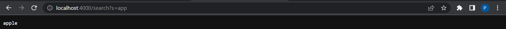

# Lab Report 2 #
## **Creating a Search Engine on a Local/Remote Web Server** ##

* Today's instructions will be how to create a local/remote webserver, and apply some functionality to it through the use of URL's.
* First, we want to have a class that can handle urls and create the functionality of a search engine.
~~~ 
{
    class Handler implements URLHandler {
        ArrayList<String> word = new ArrayList<String>();
        String searched = new String();
        String substrng = "";
        public String handleRequest(URI url) {
            if (url.getPath().equals("/")) {
                return String.format("No string");
            } else if (url.getPath().equals("/search")) {
                String[] parameters1 = url.getQuery().split("=");
                    if (parameters1[0].equals("s")) {
                        substrng = parameters1[1];
                    for (int i = 0; i< word.size(); i++){
                            if (word.get(i).contains(substrng)){
                                searched += (word.get(i) + " ");
                        }
                    }
                    return String.format(searched);
                }
                return "404 Not Found";
            } else {
                System.out.println("Path: " + url.getPath());
                if (url.getPath().contains("/add")) {
                    String[] parameters = url.getQuery().split("=");
                    if (parameters[0].equals("s")) {
                        word.add(parameters[1]);
                        return String.format("String added");
                    }
                }
                return "404 Not Found!";
            }
    }
}         
~~~

* Adding a String to the list is fundamental in being able to search/test the code so with the picture down below, it is shown that adding through the url is successful.

**Add String** 

*To break down what is exactly happening we can break down the code by parts.

~~~
{
    System.out.println("Path: " + url.getPath());
        if (url.getPath().contains("/add")) {
}
~~~

* The url.getPath() method is called from the URLClasshandler which will obtain the path from the link and check for /add which prompts that adding a string is about to happen.

~~~
{
    String[] parameters = url.getQuery().split("=");
        if (parameters[0].equals("s")) {
            word.add(parameters[1]);
            return String.format("String added");
        }
    }
    return "404 Not Found!";
}
~~~

* What's happening next is that getQuery() is gonna obtain the next piece of the url such as when ? is apart of the code. 

* By using getQuery().split("="), the left side of == and right side will be split into an array where it can get accessed. To prompt the adding of a string, it checks for an "s" on the left side of == and a string on the right side.

* Next the string on the right side of == will be added to word which is a String ArrayList that will store the strings that are added into the webserver.

* If the url does not contain an /add, s, or a string. A string error will be outputted such as "404 Not Found!";

**Search for String**

