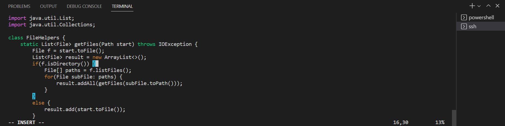

# Lab Report 4 #

## Adding a new line to print before File[] paths = f.listfiles() ##
~~~
</paths> Search for the first occurence of paths
<enter> Jumps to the line after our search.
<K> Goes up one line.
<e><e><e> Moves to end of the line
<I> Enters insert mode
<Right Arrow> Move behind parsing
<Enter> Enter new line
System.out.println(f.toString() + " is a directory"); Add print statement
<ESC> Exit Insert mode
<:wq> Saves and quits vim
<Enter> 
~~~

**/paths** 

* Searches for the first occurence of paths with the / command.

**enter**

* Jumps to the beginning of the word where it was found.

**K**

* Moves up one live with the K key

**e(1)**

* Moves to the end of each word

**e(2)** 

* Moves to end of the other word the cursor is on

**e(3)** 

* Finally moves to the end of the line but not the next availabe space

**I**

* Enters Insert Mode where changes can be made to the contents of the file itself

**Right Arrow**

* Moves to the next available space where contents can be added

**Enter**

* Moves to the next line freeing up space to add contents

**System.out.println(f.toString() + " is a directory");**

* Adds the change required to print out that the directory file is a directory

**ESC**

* Exits out of Insert Mode

**:wq**

* Saves the changes made to the file and quits out of vim

* After pressing enter to the command, :wq

## Part 2 ##
* The time it took me make the edits on the local and copy it onto my remote took me about 1:09. 
* A problem I ran to was typing speed in that it took a long time to type out all the commands such as scp'ing, and logging into the remote server and navigating through the directory to run the bash file. 
* Editing the file on the remote alone, took me about 50 seconds, there was really no problem as all the commands were sequential and no copying was needed.
* I prefer working on the vim when I want to be more efficient with my time as I can avoid copying from the local to the remote.
* A project or task that requires precision in coding may be more better on the local as the interface is easier to look at and a lot more less prone to mistakes than working within a vim. I believe that IDEs such as VSCode are a lot easier to look at when coding, so I believe that if I want to work on a program for a prolonged period of time I prefer the local.