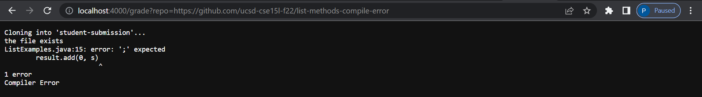
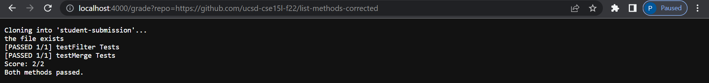
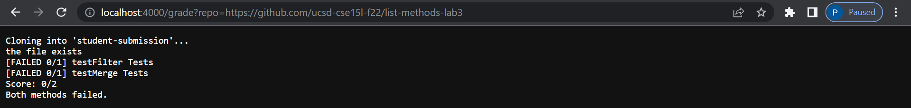

# Lab Report 5 #

* Block of code for bash script, grade.sh.
~~~
{
1 CPATH=".;../lib/hamcrest-core-1.3.jar;../lib/junit-4.13.2.jar"
2
3 rm -rf student-submission
4 git clone $1 student-submission
5 cp TestListExamples.java student-submission
6 cp lib/hamcrest-core-1.3.jar student-submission
7 cp lib/junit-4.13.2.jar student-submission
8 cd student-submission
9 points=0
10 file="ListExamples.java"
11 if [ -e $file ]
12 then  
13    echo "the file exists"
14 else 
15   echo "the file doesnt exist"
16    exit 1
17 fi
18 javac -cp $CPATH *.java
19
20 if [ $? -ne 0 ]
21 then
22   echo "Compiler Error"
23    exit 1
24 fi
25 java -cp $CPATH org.junit.runner.JUnitCore  TestListExamples > output.txt
26
27 if [ $(grep -c "testFilter" output.txt) -ne 0 ]
28 then
29   echo "[FAILED 0/1] testFilter Tests"
30 else
31   echo "[PASSED 1/1] testFilter Tests"
32    let "points+=1"
33
34 fi
35
36 if [ $(grep -c "testMerge" output.txt) -ne 0 ]
37 then
38    echo "[FAILED 0/1] testMerge Tests"
39 else
40    echo "[PASSED 1/1] testMerge Tests"
41    let "points+=1"
42
43 fi
44 if [ $points -eq 0 ]
45 then
46    echo "Score: 0/2"
47    echo "Both methods failed."
48    exit 1
49 fi
50
51 if [ $points -eq 1 ]
52 then
53    echo "Score: 0/1"
54    echo "One method passed."
55    exit 1
56 fi
57
58 if [ $points -eq 2 ]
59 then  
60    echo "Score: 2/2"
61    echo "Both methods passed."
62    exit 1
63 fi
}
~~~

* Student submission that has a syntax error causing a compile error in the grader.

* Student submission with all the methods fixed and no compile errors.

* Student submission where both methods are incorrect.

## Tracing Commands ##

* Line 3, stdout is blank, stderr is blank, return code 0
* Line 4, stdout out is blank, stderr is "Cloning into 'student-submission'...", return code 0
* Line 5, stdout out is blank, stderr is "Cloning into 'student-submission'...", return code 0
* Line 6, stdout out is blank, stderr is "Cloning into 'student-submission'...", return code 0
* Line 7, stdout out is blank, stderr is "Cloning into 'student-submission'...", return code 0
* Line 8, stdout out is blank, stderr is "Cloning into 'student-submission'...", return code 0
* Line 11, stdout is blank, stderr is blank, return code 0,
true, because there exists a file named "ListExamples.java"
* Line 13, stdout is "[PASSED 1/1] testFilter Tests", stderr is blank, return code 0
* Line 14, Line 15, Line 16 don't run because the if statement is true.
* Line 18, stdout is blank, stderr is blank, return code 0
* Line 20, stdout is blank, stderr is blank, return code 0
true, because there the compiler had a return code of 0.
* Line 22, 23 doesn't run because the if statement is not true.
* Line 25, stdout is **JUnit version 4.13.2 .. Time: 0.016 OK (2 tests)**, stderr is blank, return code 0
* Line 27, stdout is blank, stderr is blank, return code 1,the if statement is false because grep couldn't find a
character with "testFilter" in the text file because the
test didn't fail.
* Line 29, doesn't run because the if statement is false.
* Line 31, stdout is blank, stderr is blank, return code 0
* Line 36, stdout is blank, stderr is blank, return code 1,the if statement is false because grep couldn't find a
character with "testMerge" in the text file because the
test didn't fail.
* Line 38, doesn't run beacuse the if statement is false.
* Line 40, stdout is "[PASSED 1/1] testMerge Tests", stderr is blank, return code 0
* Line 41, stdout is blank, stderr is blank, return code 0
* Line 44, stdout is blank, stderr is blank, return code 1, the if statement is false because there's 2 points not zero.
* Line 46, stdout is "Score: 0/2", stderr is blank, return code 1, doesn't run because the if statement is false.
* Line 47, stdout "Both methods failed.", stderr is blank, return code 1, doesn't run because the if statement is false.
* Line 55 doesn't run because the if statement is faslse.
* Line 46,47,48 doesn't run because the if statement is false.
* Line 51, stdout is blank, stderr is blank, return code 1, the if statement is false because there's two points not one.
* Line 53, stdout is "Score: 1/2", stderr is blank, return code 1, doesn't run because the if statement is false.
* Line 54, stdout is "One method passed.", stderr is blank, return code 1, doesn't run beacuse the if statement is false.
* Line 55 doesn't run because the if statement is false.
* Line 58, stdout is blank, stderr is blank, return code 0, the if statement is true because both methods passed the test, causing for 2 points.
* Line 60, stdout is "Score: 2/2", stderr is blank, return code 0
* Line 61, stdout is "Both methods passed", stderr is blank, return code 0.
* Line 62, stdout is blank, stderr is blank, return code never runs.

